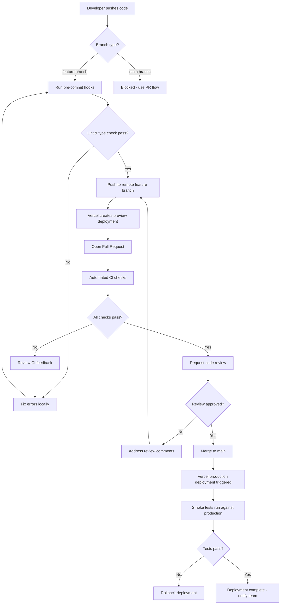
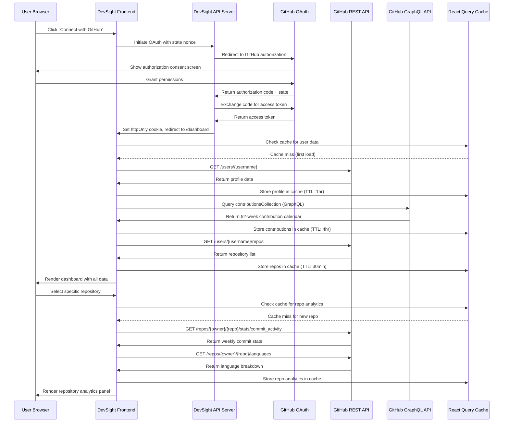
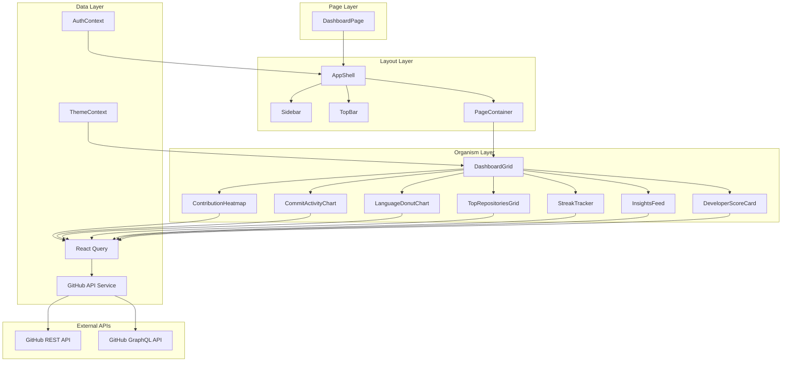

# DevSight — Developer Portfolio & GitHub Analytics Platform
## Deep Research Report · Product Architecture · Engineering Blueprint

**Document Version:** 1.0.0
**Classification:** Internal Product Planning · Engineering Handoff
**Status:** Draft — Ready for Sprint Planning
**Prepared by:** Product & Engineering Team
**Date:** 2025

---

> *DevSight is a premium developer analytics and portfolio intelligence platform engineered to transform raw GitHub data into meaningful, visually compelling career narratives. This document serves as the authoritative product planning artifact, engineering blueprint, and frontend architecture reference for the DevSight development team.*

---

## Table of Contents

1. Executive Summary
2. Competitive Analysis
3. Product Positioning
4. User Personas
5. Success Metrics
6. Full Sitemap
7. Detailed Page-by-Page Breakdown
8. Full Component Inventory
9. Dashboard Widget Breakdown
10. Data Visualization Strategy
11. GitHub API Architecture
12. State Management Architecture
13. Responsive Breakpoints
14. UI/UX Design System
15. Accessibility & SEO
16. Animations & Interaction Notes
17. Dark Mode System
18. Analytics Tracking Plan
19. Developer Insight & Analytics Generation Strategy
20. Security Considerations
21. Performance Optimization Strategy
22. Deployment Architecture
23. Docker Architecture & Containerization Strategy
24. Docker Compose Development Workflow
25. Environment Configuration Strategy
26. Containerized Local Development Setup
27. Future Scaling Roadmap
28. Database Recommendations
29. Developer Workflow Diagram (Mermaid)
30. GitHub API Data Flow Diagram (Mermaid)
31. Dashboard Architecture Diagram (Mermaid)
32. Suggested Folder Structure
33. Suggested Component Hierarchy
34. Suggested Route Structure
35. Typography System
36. Color Palette
37. Spacing System
38. Iconography Style
39. UI Inspiration References
40. Full Figma/Frontend Design Handoff Requirements
41. Timeline & Sprint Planning
42. Acceptance Criteria
43. Page Design References

---

## 1. Executive Summary

DevSight is a modern, analytics-first developer platform designed to bridge the gap between raw GitHub activity and compelling, insight-rich professional narratives. In a world where developer portfolios are increasingly evaluated not just on what was built, but *how* it was built — consistency, collaboration, language versatility, and contribution velocity — DevSight offers a differentiated intelligence layer that transforms GitHub data into a living, breathing developer profile.

At its core, DevSight is a single-page application (SPA) built on React 18, TypeScript, and Tailwind CSS, deployed on Vercel with a Dockerized local development workflow. The platform authenticates users via GitHub OAuth, fetches data using both the GitHub REST and GraphQL APIs, and presents a rich set of interactive dashboards covering contribution heatmaps, repository performance metrics, language analytics, commit patterns, and productivity scoring.

The strategic vision is threefold. First, DevSight serves as a *portfolio intelligence layer* — giving developers a way to present their GitHub history as a curated, visually polished career artifact. Second, it operates as an *analytics engine* — surfacing patterns, streaks, and insights that even the developer themselves may not consciously track. Third, it is a *professional communication tool* — enabling shareable, public-facing profile pages that recruiters, hiring managers, and collaborators can view without requiring any account.

The platform targets six primary audience segments: professional developers looking for portfolio differentiation, recruiters conducting candidate due diligence, hiring managers evaluating coding consistency, open-source contributors wanting to track their impact, computer science students building their first professional presence, and technical portfolio reviewers at companies and bootcamps.

This document constitutes the complete engineering and product planning package for DevSight. It covers competitive landscape analysis, product positioning strategy, all user personas, the full feature set broken down page-by-page, a comprehensive component inventory, data visualization strategy, GitHub API integration architecture, state management patterns, the complete design system, Docker containerization strategy, deployment architecture, performance optimization, security considerations, sprint planning, and acceptance criteria.

---

## 2. Competitive Analysis

The developer analytics and portfolio landscape has grown crowded over the past three years, yet a clear gap remains between tools that offer raw data and tools that deliver genuine insight with production-grade UX. The following analysis benchmarks DevSight against the five most relevant competitors.

### 2.1 GitHub Readme Stats (by anuraghazra)

GitHub Readme Stats is a widely adopted open-source tool that generates embeddable SVG cards showing a user's GitHub statistics — top languages, total stars, commit count, and streak data. While it enjoys massive adoption (over 60,000 GitHub stars), it is fundamentally a static badge generator, not an analytics platform.

**UI/UX Assessment:** The interface consists of URL-parameter-configured SVG cards embedded into GitHub profile READMEs. There is no interactive dashboard, no onboarding flow, and no persistent user session. Visual customization is limited to themes and a handful of layout parameters. The experience is developer-friendly in the DIY sense but inaccessible to non-technical users who cannot hand-craft embed URLs.

**Dashboard Design:** Non-existent as a true dashboard experience. Cards are isolated widgets with no cohesive layout system, no filtering, and no drill-down capability.

**Analytics Presentation:** Surface-level only. Metrics like "most used language" are calculated from repository byte-count, which is widely known to be misleading (e.g., a developer with one large Java repo appears as a Java developer regardless of their actual daily work).

**Onboarding:** Zero onboarding. Users must read documentation to understand parameter customization.

**DevSight Advantage:** DevSight replaces static card generation with an interactive, session-aware dashboard that uses GraphQL queries to fetch semantically rich data. Where GitHub Readme Stats shows totals, DevSight shows *trends*. Where it shows percentages, DevSight shows timelines and patterns.

### 2.2 WakaTime

WakaTime is a productivity tracking service that integrates directly into code editors via plugins and measures time spent coding broken down by language, project, and file. It is the most data-rich tool in this space and maintains a devoted professional user base.

**UI/UX Assessment:** WakaTime's dashboard is functional but visually dated. The interface uses a conventional left-navigation SaaS pattern with dense data tables and basic bar charts. The color system is utilitarian. Dark mode exists but feels like an afterthought. The overall aesthetic signals a data tool rather than a developer brand.

**Dashboard Design:** The dashboard is information-dense but lacks the visual hierarchy needed to guide a user's eye toward the most relevant insights. Multiple charts compete for attention without a clear narrative flow.

**Analytics Presentation:** Excellent raw data quality. WakaTime provides per-project time breakdowns, editor statistics, OS usage, and even categorized coding/browsing time. The data is highly granular but the *story* told by that data is left entirely to the user.

**Onboarding:** Requires editor plugin installation, which creates meaningful friction. A developer must install, configure, and actively code for several days before the dashboard becomes meaningful.

**Developer Engagement:** Strong among power users who value time-tracking precision. Weak among casual users or those without programming as their primary daily activity.

**DevSight Advantage:** DevSight requires zero plugin installation. GitHub OAuth is the only integration point, making onboarding frictionless. DevSight does not track keystroke-level data (which raises privacy concerns for some users) but instead leverages commit history and contribution graphs, which are already public or semi-public data that developers have implicitly consented to share.

### 2.3 GitHub Wrapped (by neat-run)

Inspired by Spotify Wrapped, GitHub Wrapped generates an annual retrospective of a developer's GitHub activity as a shareable visual story. The concept is strong and the execution is charming.

**UI/UX Assessment:** The UI is visually polished and narrative-driven, with animated slides and strong use of color. However, it is an annual, read-only experience with no interactivity beyond navigation between slides. Users cannot explore their data, filter by repository, or drill into specific time periods.

**Dashboard Design:** No persistent dashboard. The experience is a one-time shareable artifact, not a continuous analytics platform.

**Analytics Presentation:** Engaging and emotionally resonant but analytically shallow. The platform communicates volume (commits, PRs, stars earned) rather than quality or pattern.

**Onboarding:** Frictionless — username input only, no OAuth required for public profiles.

**Conversion Flows:** Low retention by design. The product is consumed once per year and shared on social media. There is no mechanism for ongoing engagement.

**DevSight Advantage:** DevSight adopts the visual polish and narrative engagement of GitHub Wrapped but applies it to a *continuous*, always-updated analytics platform. The "year in review" concept becomes an always-on intelligence layer. The shareable profile feature in DevSight is permanently live, not a once-per-year export.

### 2.4 GitHub Profile Insights (various tools)

Several tools, including GitStats and Sourcegraph's code intelligence features, offer repository-level or profile-level insights. These tend to be either self-hosted, developer-tools-first (command-line oriented), or embedded within larger platforms.

**UI/UX Assessment:** Generally poor consumer UX. Tools in this category are designed for engineering teams, not individual developers seeking portfolio presentation.

**DevSight Advantage:** DevSight is purpose-built for individual developer presentation with a consumer-grade UI, making analytics accessible to developers at all experience levels.

### 2.5 GitKraken Analytics (via GitKraken Insights)

GitKraken offers team-level repository analytics primarily targeting engineering managers and team leads. Their Insights feature covers PR cycle time, merge frequency, and team velocity.

**UI/UX Assessment:** Professional and well-designed, but heavily team-oriented. Individual contributor analytics are secondary to team aggregate metrics.

**Dashboard Design:** Strong visual system, well-organized layout, good use of color to differentiate metrics. The design aesthetic leans enterprise.

**Personalization:** Minimal for individual developers. The platform is optimized for team leads, not solo developers or job-seekers.

**DevSight Advantage:** DevSight is individual-first. Every feature, every visualization, and every insight is oriented around a single developer's growth, visibility, and professional narrative.

### 2.6 Competitive Analysis Summary

| Dimension | GitHub Readme Stats | WakaTime | GitHub Wrapped | GitKraken | **DevSight** |
|---|---|---|---|---|---|
| Interactive Dashboard | No | Yes | No | Yes | **Yes** |
| Zero-Install Onboarding | Yes | No | Yes | No | **Yes** |
| Continuous Analytics | No | Yes | No | Yes | **Yes** |
| Shareable Profile | Limited | No | Yes | No | **Yes** |
| Portfolio Presentation | No | No | Partial | No | **Yes** |
| Dark Mode | Partial | Yes | No | Yes | **Yes** |
| Mobile Responsive | Partial | Partial | Yes | Partial | **Yes** |
| Open Source Friendly | Yes | Partial | Yes | No | **Yes** |
| Individual-First Design | Yes | Yes | Yes | No | **Yes** |
| Visual Design Quality | Medium | Medium | High | High | **High** |

---

## 3. Product Positioning

DevSight occupies the intersection of three distinct value propositions: portfolio presentation tool, analytics platform, and developer brand builder. No existing product owns all three simultaneously.

The positioning statement reads: *"DevSight is the analytics-first developer portfolio platform that transforms your GitHub history into a professional narrative — giving developers the visibility they deserve and recruiters the signal they need."*

DevSight is not a GitHub replacement, a project management tool, or a team analytics product. It is a *personal developer intelligence layer* that sits on top of GitHub's existing data infrastructure and translates it into an experience built for career development, professional presentation, and self-directed growth tracking.

The pricing model (for future implementation) follows a freemium SaaS approach: a free tier covering core dashboard access and basic analytics, and a Pro tier unlocking advanced insights, custom portfolio branding, detailed productivity scoring, and API export capabilities.

---

## 4. User Personas

### 4.1 Persona: The Ambitious Junior Developer — "Arjun"

Arjun is a 22-year-old computer science graduate actively applying to his first full-time developer role. He has contributed to several personal projects and a few open-source repositories but struggles to communicate his technical breadth effectively on a traditional resume. He wants to show that he codes consistently, learns quickly, and works across multiple languages.

**Goals:** Stand out in a competitive junior developer job market; demonstrate coding consistency over time; showcase language diversity and project variety.

**Pain Points:** GitHub profile pages look identical for all skill levels; no way to visualize growth trajectory; resume doesn't capture commit consistency.

**How DevSight Helps:** Arjun uses DevSight to generate a shareable portfolio link that shows his contribution heatmap, language evolution chart, and top repositories with performance metrics. Recruiters reviewing his application can see at a glance that he codes daily and has growing proficiency in TypeScript and Go.

### 4.2 Persona: The Senior Engineer Building a Personal Brand — "Priya"

Priya is a 31-year-old senior software engineer with 8 years of experience who is beginning to write technical blog posts and build a presence on LinkedIn and X. She contributes regularly to two open-source projects and wants analytics to understand her contribution impact.

**Goals:** Understand which repositories drive the most engagement; track open-source contribution consistency; build a professional portfolio link to include in bio.

**Pain Points:** Existing GitHub analytics are surface-level; no way to see contribution velocity over time; no shareable formatted profile.

**How DevSight Helps:** Priya uses DevSight's developer insights page to understand her commit patterns, contribution streaks, and repository impact scores. She adds her DevSight profile link to her blog and Twitter bio, giving visitors instant insight into her technical background.

### 4.3 Persona: The Technical Recruiter — "Marcus"

Marcus is a 35-year-old technical recruiter at a Series B startup evaluating 40+ developer candidates per month. He wants to quickly assess coding consistency, language proficiency, and project complexity without spending 30 minutes per candidate on manual GitHub profile review.

**Goals:** Quickly evaluate candidate technical signal; compare contributors across dimensions; verify portfolio claims.

**Pain Points:** Raw GitHub profiles require domain expertise to interpret; commit counts are gameable; no standardized presentation format.

**How DevSight Helps:** When candidates share their DevSight profile link, Marcus sees a standardized, recruiter-friendly dashboard showing productivity scores, language distribution, contribution consistency, and repository highlights — all without needing a GitHub account himself.

### 4.4 Persona: The Open Source Contributor — "Li Wei"

Li Wei is a 28-year-old developer who contributes to multiple open-source projects in her free time. She wants to track her contribution streaks, understand which projects benefit most from her work, and maintain motivation through visual progress tracking.

**Goals:** Maintain contribution streaks; track cross-repository impact; visualize coding habits over time.

**How DevSight Helps:** Li Wei's DevSight dashboard shows her cross-repository contribution heatmap, her longest and current streak, and a breakdown of her contributions by project. The productivity score gamifies consistent contribution.

### 4.5 Persona: The Bootcamp Graduate — "Jordan"

Jordan is a 26-year-old career changer who completed a 12-week bootcamp and is building their first developer portfolio. They have 6 months of GitHub activity but no professional experience and need to present their learning journey compellingly.

**Goals:** Make a strong first impression without professional credentials; show learning velocity; present projects professionally.

**How DevSight Helps:** Jordan uses DevSight's portfolio showcase feature to highlight their top three projects with detailed analytics and their contribution heatmap showing 6 months of consistent daily coding.

---

## 5. Success Metrics

Success for DevSight is measured across four dimensions: acquisition, engagement, retention, and platform health.

**Acquisition Metrics** track how effectively DevSight attracts new users. The primary acquisition metric is Weekly New User Signups via GitHub OAuth. Secondary metrics include organic search traffic to the landing page, referral traffic from shared DevSight profile links (a viral growth vector), and social media mentions. A 20% week-over-week growth rate is the target for the first six months post-launch.

**Engagement Metrics** measure depth of platform use. The key engagement signals are Dashboard Session Duration (target: >4 minutes average), Pages Per Session (target: >3), Repository Analytics Page Views per user (target: >5 per week), and the percentage of users who generate and share their public profile link (target: 35% of registered users within the first 30 days).

**Retention Metrics** measure whether users return. The primary retention signal is D7 retention — what percentage of users return within 7 days of signup. A target of 40% D7 retention indicates that the analytics are surfacing genuinely interesting insights rather than one-time curiosity views. Monthly Active Users (MAU) as a percentage of total registered users (target: 30%+ MAU/registered ratio) measures ongoing platform health.

**Platform Health Metrics** cover reliability, performance, and developer experience. Target metrics include API response time under 300ms for cached responses, Time to Interactive (TTI) under 2.5 seconds, GitHub API rate limit headroom above 60% during peak usage periods, and Lighthouse performance scores above 90.

**Business Metrics** (for post-monetization phases) include Free-to-Pro conversion rate (target: 8%), monthly recurring revenue growth, and average revenue per user. These metrics will be tracked from launch of the Pro tier and will not be used to evaluate pre-monetization engineering success.

---

## 6. Full Sitemap

The DevSight sitemap is organized around three tiers: the public marketing surface, the authenticated application core, and the public shareable profile system. Each tier serves a distinct user journey.

The public marketing surface includes the root landing page, an about page, a features overview page, a pricing page (initially showing a "coming soon" state), a changelog/release notes page, and an authentication entry point. These pages are statically rendered and SEO-optimized.

The authenticated application core is the main SaaS product and includes the main dashboard, repository analytics, developer insights, portfolio management, profile settings, notification preferences, and account/billing management. These pages require active GitHub OAuth sessions and are client-rendered.

The public shareable profile system consists of dynamically generated public profile pages accessible at a vanity URL pattern (e.g., `/u/[username]`). These pages are server-side rendered for SEO and social sharing metadata support. They include the full analytics summary, top repositories, contribution heatmap, and language breakdown — all in a read-only, recruiter-friendly format.

```
/                           → Landing Page
/about                      → About DevSight
/features                   → Feature Overview
/pricing                    → Pricing (Freemium Model)
/changelog                  → Release Notes & Updates
/auth/login                 → GitHub OAuth Entry
/auth/callback              → OAuth Callback Handler
/auth/logout                → Session Termination
/dashboard                  → Main Analytics Dashboard (Protected)
/dashboard/repositories     → Repository List & Analytics
/dashboard/repository/:id   → Single Repository Deep Dive
/dashboard/insights         → Developer Insights & Scoring
/dashboard/contributions    → Contribution Heatmap & Streak Analytics
/dashboard/languages        → Language Usage Analytics
/portfolio                  → Portfolio Management
/portfolio/edit             → Portfolio Customization
/settings                   → User Settings
/settings/profile           → Profile Configuration
/settings/appearance        → Theme & Display Preferences
/settings/notifications     → Notification Management
/settings/integrations      → Connected Services
/settings/privacy           → Privacy & Sharing Controls
/settings/account           → Account & Billing
/u/:username                → Public Developer Profile (SSR)
/u/:username/repositories   → Public Repository Showcase
/404                        → Not Found Page
/500                        → Server Error Page
```

---

## 7. Detailed Page-by-Page Breakdown

### 7.1 Home / Landing Page (`/`)

The landing page is the primary acquisition and conversion surface. Its architecture must balance marketing clarity with technical credibility, speaking simultaneously to developers (who will use the product) and recruiters (who will view shared profiles but may influence adoption through word of mouth).

**Hero Section:** Full-viewport-width hero with animated dashboard preview, primary headline ("Turn Your GitHub Into a Developer Portfolio That Speaks for Itself"), sub-headline establishing the value proposition, and dual CTAs: "Connect with GitHub" (primary, initiates OAuth) and "View Demo Dashboard" (secondary, loads a pre-seeded demo account). The hero background uses a subtle animated gradient or particle system to communicate dynamism without distraction.

**Feature Highlights Section:** Three-column feature grid presenting the three core value propositions: Analytics Intelligence, Portfolio Presentation, and Developer Productivity Scoring. Each cell uses a micro-animation on scroll entry, a distinct icon, and a two-sentence description.

**Dashboard Preview Section:** An interactive browser-frame mockup showing the actual DevSight dashboard with live-updating demo data. This section is the primary product proof-of-concept and should be visually spectacular. The mockup auto-scrolls through dashboard sections on a timer.

**Social Proof Section:** Developer testimonials, GitHub star count (if open-sourcing), and logos of represented companies from developer users (opt-in).

**CTA Footer Section:** Repeat of the primary CTA with email capture for waitlist/newsletter.

### 7.2 Dashboard Page (`/dashboard`)

The dashboard is the product's anchor experience and the page users will return to most frequently. Its architecture follows a widget-grid pattern where each analytics dimension gets its own card, but the visual hierarchy guides attention toward the most meaningful signals first.

**Header Zone:** User avatar, GitHub username, last sync timestamp, a "Refresh Data" button that triggers a fresh GitHub API pull, and quick-access navigation to sub-sections.

**Stats Banner:** Four hero KPI cards arranged horizontally — Total Commits (current year), Active Repositories, Longest Contribution Streak, and Developer Productivity Score. These cards use large typography, trend indicators (up/down arrows with percentage change vs. last period), and sparkline mini-charts.

**Contribution Heatmap Widget:** Full-width contribution activity heatmap spanning the last 12 months, styled consistently with GitHub's visualization but with enhanced interactivity — hoverable cells showing exact counts and a filter to highlight specific repositories or languages.

**Repository Performance Grid:** A sorted, filterable grid of the user's repositories with inline sparklines for commit frequency, total stars, forks, and last activity date. Supports filtering by language, sorting by various metrics, and expanding a row for quick analytics preview.

**Language Distribution Chart:** A donut chart showing language distribution by repository count and by lines of code, with the ability to toggle between the two metrics. Adjacent to the chart, a ranked language list with trend indicators.

**Commit Activity Chart:** A multi-series line chart showing daily commit activity over configurable time windows (7 days, 30 days, 90 days, 1 year). Supports overlay comparison (this period vs. last period).

**Coding Streak Analytics:** A dedicated streak tracker showing current streak, longest streak, total active days, and a calendar-style visualization of streak continuity.

### 7.3 Repository Analytics Page (`/dashboard/repositories`)

The repository analytics page provides deep per-repository intelligence. Users can select any repository from their profile and access a dedicated analytics view showing commit frequency over time, contributor breakdown (for multi-contributor repos), issue and PR velocity, language composition, code size evolution, and release history.

The page layout uses a two-column split — a sortable, filterable repository list on the left, and a dynamic analytics panel on the right. Selecting a repository updates the right panel without a full page reload, maintaining application state.

Key visualizations on this page include a commit frequency bar chart (daily/weekly/monthly toggle), a language pie chart specific to the selected repository, a lines-of-code timeline chart, and for public repos with multiple contributors, a contribution breakdown donut chart.

### 7.4 Developer Insights Page (`/dashboard/insights`)

Developer Insights is the platform's most differentiated feature — a page dedicated to surfacing non-obvious patterns and generating automated intelligence from the user's GitHub data. Rather than simply presenting raw metrics, this page synthesizes data across repositories and time periods to surface actionable insights.

Insight categories include: Coding Consistency Score (based on contribution streak continuity and day-of-week patterns), Language Growth Trajectory (detecting which languages show increasing vs. decreasing usage over time), Project Momentum Analysis (identifying repositories with accelerating vs. decelerating commit velocity), Collaboration Pattern Insights (for multi-contributor repositories), and Productivity Rhythm Analysis (identifying peak coding hours and days based on commit timestamp data).

Each insight card presents a headline finding, a supporting visualization, and a contextual explanation. For example: "Your TypeScript usage has grown 340% over the past 6 months — you're on track to make it your primary language by Q3."

### 7.5 Portfolio Page (`/portfolio`)

The portfolio page is the developer's curated professional presentation layer. Unlike the analytics dashboard (which shows everything), the portfolio page is about *curation* — selecting which repositories, skills, and achievements to highlight for professional audiences.

The portfolio editor allows selecting up to 6 featured repositories with custom descriptions, choosing which analytics to display publicly, setting a custom bio and professional headline, adding links to external profiles (LinkedIn, personal site, Twitter/X), and toggling visibility of various analytics sections.

The preview mode shows exactly how the portfolio appears to visitors at the public `/u/:username` URL.

### 7.6 Settings Pages (`/settings/*`)

Settings pages cover profile configuration (bio, avatar, social links), appearance preferences (theme, density, chart color palette), notification settings, privacy controls (controlling which analytics are visible on the public profile), integration management, and account/billing. Settings are organized in a left-navigation tab pattern and persist to user preferences stored server-side.

### 7.7 Authentication Flow (`/auth/login` → `/auth/callback`)

The authentication flow is a single-step GitHub OAuth exchange. Users click "Connect with GitHub," are redirected to GitHub's OAuth authorization page, grant the requested scopes (read access to repos, user profile, and contribution history), and are redirected back to `/auth/callback` where the authorization code is exchanged for an access token. The access token is stored securely (httpOnly cookie) and the user is redirected to `/dashboard`. New users see a brief onboarding overlay on first login.

### 7.8 Public Profile Page (`/u/:username`)

The public profile is server-side rendered to enable social sharing metadata (Open Graph tags for Twitter/LinkedIn card previews) and SEO indexing. It displays a recruiter-optimized summary view of the developer's analytics, including the contribution heatmap, top 4 repositories, language distribution, and developer insights highlights. No DevSight account is required to view a public profile.

---

## 8. Full Component Inventory

The component architecture follows atomic design principles, organizing components into atoms, molecules, organisms, templates, and pages. Each component is built as a self-contained TypeScript functional component with well-defined prop interfaces.

**Atoms** are the smallest, non-decomposable UI elements. The inventory includes: `Button` (variants: primary, secondary, ghost, danger; sizes: sm, md, lg), `Badge` (used for language labels, status indicators), `Avatar` (GitHub avatar with fallback initial), `Icon` (wrapper around Lucide React icon set), `Spinner` (loading state indicator), `Tooltip` (floating tooltip with delay), `Tag` (repository topic/language tag), `Divider` (horizontal rule with optional label), `KPINumber` (animated counter for hero statistics), and `TrendIndicator` (up/down arrow with percentage).

**Molecules** compose atoms into functional UI units. The inventory includes: `StatCard` (KPI card with icon, value, trend, and sparkline), `RepoCard` (repository summary card with key metrics), `LanguagePill` (language badge with color dot), `InsightCard` (insight with heading, explanation, and supporting chart), `SearchInput` (search bar with debounce), `FilterDropdown` (multi-select filter with checkbox options), `SortMenu` (sort options dropdown), `DateRangePicker` (time window selector for charts), `ProfileBadge` (avatar + name + handle group), `StreakBadge` (streak count with fire icon), `SkillBar` (horizontal bar showing language proficiency proxy), and `NotificationToast` (success/error/info toast message).

**Organisms** are complex, feature-level components that combine molecules and atoms. The inventory includes: `ContributionHeatmap` (full-year GitHub-style activity grid), `RepoAnalyticsTable` (filterable, sortable repository list), `LanguageDonutChart` (language distribution visualization), `CommitActivityChart` (multi-series commit timeline), `DeveloperScoreCard` (productivity score with breakdown), `InsightsFeed` (paginated list of developer insights), `PortfolioEditor` (drag-and-drop portfolio customization interface), `AuthModal` (login modal with GitHub OAuth button), `RepoDeepDive` (full repository analytics panel), `ProfileHeader` (public profile hero section), `StreakTracker` (streak calendar visualization), and `DashboardGrid` (responsive widget grid layout manager).

**Layout Components** control page structure and include: `AppShell` (main authenticated layout with sidebar), `PageContainer` (content width constraints and padding), `DashboardLayout` (dashboard-specific two-column layout), `PublicLayout` (unauthenticated pages layout), `Sidebar` (collapsible navigation sidebar), `TopBar` (fixed top navigation with user menu), and `MobileNav` (bottom tab navigation for mobile breakpoints).

**Chart Components** are specialized visualization components built on Recharts or Chart.js. They include: `ContributionHeatmap`, `CommitFrequencyBarChart`, `LanguagePieChart`, `ActivityLineChart`, `RepoStarsTrend`, `LanguageRadarChart`, `ContributionCalendar`, `MiniSparkline`, and `HeatmapCell`.

---

## 9. Dashboard Widget Breakdown

The main dashboard assembles the following widgets in a responsive grid, with priority order determining render order on narrow viewports.

**Priority 1 — Identity & Status Widget:** Developer identity card showing GitHub avatar, display name, username, bio excerpt, account creation year, follower/following counts, and last-updated timestamp. This widget anchors the dashboard and provides immediate context for the analytics below.

**Priority 2 — KPI Metrics Strip:** A horizontal row of four animated stat cards presenting the user's most critical numbers: total commits in the current year, public repositories count, current contribution streak (days), and overall DevSight Productivity Score (0–1000). Each card shows the current value with a trend arrow and percentage change vs. the same period last year.

**Priority 3 — Contribution Heatmap:** The centerpiece visualization. A 52-column, 7-row grid showing daily contribution activity over the past 52 weeks, color-coded by intensity. Includes interactive tooltips on hover, a color legend, total contributions count, and controls for filtering by specific repositories.

**Priority 4 — Commit Activity Chart:** A time-series line chart showing daily commit activity over the selected window (7/30/90 days or 1 year). Supports brush selection for zooming into specific date ranges. Optional overlay showing the rolling 7-day average.

**Priority 5 — Language Distribution Chart:** A donut chart with percentage breakdowns and a ranked list. Supports toggling between "by repository count" and "by bytes committed" calculation methods.

**Priority 6 — Top Repositories Grid:** A 2×3 or 3×2 card grid showing the user's 6 most-starred or most-active repositories. Each card shows repository name, description excerpt, primary language, star count, fork count, and a sparkline showing recent activity.

**Priority 7 — Coding Streak Analytics:** A compact calendar view showing streak continuity over the past 3 months, current streak, longest-ever streak, and total active coding days this year.

**Priority 8 — Developer Insights Preview:** A scrollable list of 3–5 most recently generated insights, with a "View All Insights" link to the full insights page.

---

## 10. Data Visualization Strategy

The data visualization strategy for DevSight is guided by four principles: clarity over complexity, interactivity over static display, context over isolated numbers, and consistency over variety.

**Clarity Over Complexity** means every chart has a single primary question it answers. The contribution heatmap answers "How consistently do I code?" The language donut answers "What languages define my technical profile?" Charts that attempt to answer multiple questions simultaneously are split into separate visualizations with linking interactions.

**Interactivity Over Static Display** means every chart supports hover states, click interactions, and where appropriate, brush/zoom selection. Tooltips provide precise data on hover. Clicking a data point (e.g., a heatmap cell) opens a contextual panel showing the repositories and commits for that specific day.

**Context Over Isolated Numbers** means raw metrics are always displayed with reference points. A commit count of 847 is meaningless without context — DevSight shows it alongside the previous-period comparison, the user's personal average, and where applicable, a percentile indicator among DevSight users.

**Consistency Over Variety** means the same visualization type is used for the same data pattern throughout the application. Temporal trend data always uses line charts. Distribution data always uses donut charts. Comparison data always uses horizontal bar charts. This visual grammar creates a predictable, learnable interface.

**Library Strategy:** The primary visualization library is Recharts, chosen for its React-native component API, responsive container system, and excellent TypeScript support. Chart.js is used selectively for visualizations that require canvas-based rendering performance (the contribution heatmap with 365 cells benefits from canvas rendering) or for specific chart types not available in Recharts. All chart components are wrapped in custom TypeScript interfaces to abstract library-specific APIs and ensure consistent theming.

**Theming Integration:** All chart components accept a `theme` prop that switches between light and dark color palettes. The color palette for charts uses a carefully selected set of 8 accessible colors that maintain sufficient contrast in both light and dark modes. Language colors follow GitHub's established language color conventions where possible to leverage existing mental models.

---

## 11. GitHub API Architecture

DevSight relies on two distinct GitHub API surfaces, used for different data access patterns.

**GitHub REST API v3** is used for high-level profile data, repository metadata, rate limit checking, and data that follows straightforward request-response patterns. Key endpoints used include `/users/{username}` for profile data, `/users/{username}/repos` for repository listings, `/repos/{owner}/{repo}/commits` for commit history, `/repos/{owner}/{repo}/languages` for language breakdown, and `/repos/{owner}/{repo}/stats/commit_activity` for weekly commit statistics.

**GitHub GraphQL API v4** is used for complex, multi-resource queries that would require many REST calls to satisfy — particularly the contribution calendar data (which has no direct REST equivalent), pinned repositories, and cross-repository contribution statistics. The GraphQL API's ability to request exactly the fields needed in a single round trip is critical for performance on dashboard-heavy pages. The primary GraphQL query used is the `contributionsCollection` query which returns the complete contribution calendar, total contribution counts, and streak data.

**Rate Limit Management:** GitHub REST API allows 5,000 requests per hour for authenticated users. GitHub GraphQL API allows 5,000 points per hour. DevSight manages rate limits through a multi-layered caching strategy: in-memory caching for the current session, localStorage caching with TTL (Time To Live) for data that doesn't change frequently (repository list, language breakdown), and a backend queue for non-urgent background refresh operations.

**Token Scope Strategy:** DevSight requests the minimum necessary OAuth scopes. For public repositories only: `read:user`, `public_repo`. For users who want private repository analytics (Pro feature): `repo` and `read:org`. Scopes are requested incrementally — the minimal public-repo scope is requested on initial auth, and additional scopes are requested only when the user explicitly requests private repository features.

**Data Refresh Strategy:** On initial login, a full data pull is performed. Subsequently, data is refreshed on-demand when the user clicks "Refresh" or when the cached data is older than 4 hours. A lightweight background poll checks only the contribution count every 30 minutes during active sessions to keep the streak counter accurate.

---

## 12. State Management Architecture

DevSight uses a layered state management approach that matches state scope to state storage mechanism, avoiding both global state pollution and prop-drilling.

**Server State** — data fetched from the GitHub API — is managed by React Query (TanStack Query). React Query provides automatic caching, background refetching, stale-while-revalidate behavior, loading/error state management, and optimistic updates. Each GitHub API resource is represented as a React Query key, enabling fine-grained cache invalidation. For example, `queryKey: ['repos', username]` caches the repository list for a specific user, and `queryKey: ['contributions', username, year]` caches contribution data per year.

**Global Application State** — authentication status, user preferences, theme selection, and notification state — is managed via React Context API. The global state is intentionally minimal, containing only data that genuinely needs to be accessible across the entire component tree. The `AuthContext` provides current user data and authentication methods. The `ThemeContext` provides the current theme and toggle function. The `PreferencesContext` provides user settings like dashboard layout preferences and chart color palette selection.

**Local Component State** — filter selections, sort orders, expanded/collapsed UI states, form values — is managed with `useState` and `useReducer` hooks within the components that own that state. This prevents over-centralization and keeps component logic self-contained.

**URL State** — active filters, selected time windows, active repository selection — is synced to URL query parameters using a custom `useQueryParams` hook. This enables deep linking (sharing a URL that opens a specific repository's analytics view with specific filters applied) and browser history navigation within the dashboard.

**Persistence Strategy:** User preferences and cached API responses are persisted to localStorage. Authentication tokens are stored exclusively in httpOnly cookies, inaccessible to JavaScript, protecting against XSS-based token theft.

---

## 13. Responsive Breakpoints

DevSight uses a mobile-first breakpoint system aligned with Tailwind CSS's default breakpoint scale, with one custom addition for ultra-wide displays.

The breakpoint definitions are as follows: `xs` at 375px covers small mobile devices (iPhone SE, older Android flagships); `sm` at 640px covers larger mobile devices and small tablets; `md` at 768px covers tablets in portrait orientation; `lg` at 1024px covers tablets in landscape and small laptops (the primary dashboard breakpoint where the sidebar appears); `xl` at 1280px covers standard laptop and desktop displays; `2xl` at 1536px covers large desktop monitors; and a custom `3xl` at 1920px covers ultra-wide displays where the dashboard grid can expand to a 3-column layout.

**Layout Behavior by Breakpoint:**

On `xs`/`sm` (mobile), the sidebar is hidden and replaced by a bottom tab navigation bar. The dashboard widget grid collapses to a single column. Charts reduce to a simplified mobile-optimized rendering. The contribution heatmap shows the most recent 12 weeks instead of 52. The KPI strip stacks to a 2×2 grid.

On `md` (tablet), the sidebar appears as an icon-only rail (no labels). The widget grid moves to a 2-column layout. Charts show full interactivity but with touch-optimized tooltip behavior.

On `lg`/`xl` (laptop), the full sidebar with labels is visible. The widget grid uses a 12-column CSS Grid with widgets spanning 4, 6, 8, or 12 columns depending on their content type. All chart features are available.

On `2xl`/`3xl` (large desktop), the layout gains a third column in the widget grid for auxiliary information panels. Maximum content width is capped at 1440px to maintain readability on ultra-wide displays.

---

## 14. UI/UX Design System

DevSight's design system is built as a comprehensive set of design tokens implemented as Tailwind CSS configuration extensions, creating a single source of truth for all visual decisions.

The design philosophy is "analytical clarity with premium finish" — the interface must communicate data precision and technical depth while feeling polished enough to use as a professional presentation tool. The aesthetic draws inspiration from Linear's clean engineering aesthetic, Vercel's dark-mode premium feel, and Stripe's data visualization clarity.

**Component Library Philosophy:** All UI components are built in-house rather than adopting a component library wholesale. This ensures complete visual control and eliminates the "generic SaaS" aesthetic. The component library is internally maintained and documented with Storybook.

**Visual Language:** Rounded corners (border-radius: 8px for cards, 6px for buttons, 4px for tags) create approachability without softness. Subtle shadows with low spread and low opacity create depth without decoration. Border-based card demarcation (1px border with semi-transparent color) is used in preference to heavy shadows, keeping the interface clean on both light and dark backgrounds.

**Grid System:** A 12-column CSS Grid forms the foundation of all page layouts. The dashboard uses a custom widget grid system built on CSS Grid where widget components specify their own column span via props, enabling flexible layout configuration without complex positioning logic.

---

## 15. Accessibility & SEO

**Accessibility (WCAG 2.1 AA Compliance):**

All interactive elements maintain a minimum touch target size of 44×44px. Focus states are visible and styled using a consistent 2px outline in the primary brand color. The color palette maintains minimum contrast ratios of 4.5:1 for body text, 3:1 for large text and UI components, and 7:1 for critical information display. The contribution heatmap includes an accessible alternative representation — a summary table with the same data — visible to screen readers via ARIA labelling but hidden visually.

ARIA labels are applied to all chart components, with descriptive text summarizing the chart's key finding. For example, the contribution heatmap ARIA label reads "Contribution activity chart showing 1,247 contributions in the past year, with the highest activity in October." Interactive chart elements (hoverable cells, clickable data points) are keyboard-navigable.

All images use descriptive alt text. All form inputs have associated labels. Page flow follows logical heading hierarchy (H1 → H2 → H3 with no skipped levels).

**SEO Strategy:**

Public profile pages (`/u/:username`) are the primary SEO surface. They are server-side rendered with dynamic Open Graph meta tags that generate preview cards customized to each developer: `og:title` shows "DevSight — {Name}'s Developer Profile", `og:description` shows the developer's top 3 languages and contribution summary, and `og:image` generates a dynamic social preview image (rendered server-side using a headless renderer).

The landing page targets keywords including "developer portfolio analytics," "GitHub analytics dashboard," "developer productivity tracking," and "GitHub contribution tracker." Blog content (future feature) will support long-tail keyword strategy.

---

## 16. Animations & Interaction Notes

Animations in DevSight follow the principle of *purposeful motion* — every animation either communicates state change, guides attention, or provides feedback. Decorative animation is minimal to maintain the professional, data-focused aesthetic.

**Loading States:** Skeleton screens replace spinner overlays for all content-heavy components. Skeleton screens maintain the spatial layout of the actual content, reducing perceived load time and preventing layout shift on data arrival. The skeleton uses a shimmer animation (left-to-right gradient sweep) at 1.5s per cycle.

**Data Entry Animations:** Number counters in KPI cards animate from zero to their final value on first render using a spring easing function over 800ms. This creates a satisfying "counting up" effect that makes metrics feel earned rather than static.

**Chart Animations:** Chart data entry uses a staggered reveal — bars grow from the baseline, lines draw from left to right, and donut segments appear with a clockwise sweep. These animations run once on component mount and are skipped for users who have `prefers-reduced-motion` enabled.

**Page Transitions:** Route transitions use a subtle fade-and-translate effect (200ms, easing out) to communicate navigation depth without heavy animation overhead. Framer Motion handles all page transition animation to ensure consistency.

**Hover States:** Interactive cards use a 3ms transform scale (1.01×) with a shadow intensification on hover, creating a tactile "lift" effect. Buttons use background color transitions at 150ms. Links use underline animations.

**Micro-interactions:** The refresh button spins while data is loading. The productivity score widget has a celebration animation (confetti burst) when the user achieves a new personal high score. Streak badges animate when a new streak day is achieved.

---

## 17. Dark Mode System

Dark mode is a first-class feature in DevSight, not an afterthought. Given that the primary audience is developers (who are disproportionately dark-mode users), the dark mode design receives equal design investment as the light mode.

**Implementation Approach:** Theme switching is implemented via a CSS custom properties (CSS variables) system. A `data-theme` attribute on the root `<html>` element switches between `light` and `dark` variable sets. Tailwind CSS's `darkMode: 'class'` configuration is used to enable Tailwind dark-mode utilities. The user's preference is persisted to localStorage and applied before first paint to eliminate the light-flash-then-dark flicker on page load.

**Color Mapping System:** Every semantic color token has both a light and dark value. The background hierarchy uses three levels: base background (white / near-black), elevated surface (light gray / dark gray), and raised card (lighter gray / slightly lighter dark gray). This three-level system creates depth and hierarchy without needing shadows.

**Chart Color Adaptation:** Chart colors are specifically designed to read well in both themes. The contribution heatmap uses green shades in light mode and teal shades in dark mode (green on dark can read as sickly or low-contrast). All chart colors are tested against both backgrounds at AA contrast ratios.

**System Preference Respect:** On first visit, DevSight reads `prefers-color-scheme` media query and sets the initial theme accordingly. Once a user explicitly selects a theme in settings, their choice overrides the system preference. The option to "follow system" is available in settings.

---

## 18. Analytics Tracking Plan

DevSight uses a privacy-respecting, event-based analytics system to understand product usage. All analytics are anonymized (user IDs are hashed) and no personally identifiable information is transmitted to analytics services.

**Pageview Tracking:** Every route change generates a pageview event with the route path (not including URL parameters that could contain usernames). Dashboard, repository analytics, and insights page views are tracked as distinct event categories.

**Feature Usage Events:** Key feature interactions tracked include: GitHub OAuth completion, dashboard widget interaction (click, hover for >2 seconds), chart filter/sort usage, repository selection in the analytics panel, public profile link generation, dark/light mode toggle, date range adjustment, and insight card expansion.

**Performance Events:** Core Web Vitals (LCP, FID, CLS) are reported using the `web-vitals` library. API response time distributions are tracked as histograms. GitHub API rate limit proximity events are tracked to identify usage patterns that approach limits.

**Error Tracking:** Client-side errors are captured by an error boundary system that reports to an error monitoring service (Sentry). GitHub API errors (rate limit exceeded, auth failure, not found) are tracked as distinct error events.

**Analytics Tool Selection:** PostHog (self-hostable, GDPR-compliant) is the recommended analytics platform for DevSight, aligning with the developer-audience values around privacy and data sovereignty.

---

## 19. Developer Insight & Analytics Generation Strategy

The Developer Insights feature is the platform's core differentiator, and its quality determines whether DevSight delivers genuine value beyond what GitHub itself surfaces. Insights are generated by a client-side computation engine that processes the user's GitHub data through a series of analysis functions.

**Insight Categories and Generation Logic:**

*Coding Consistency Score* is calculated as a composite of contribution streak continuity (percentage of days with at least one contribution over the past 90 days), weekday coding frequency (developers who code consistently on weekdays signal professional discipline), and recovery patterns (how quickly the developer resumes coding after gaps). The score is normalized to 0–100 and categorized as Beginner (0–40), Developing (40–60), Consistent (60–80), or Elite (80–100).

*Language Growth Trajectory* compares language byte-count distribution across repositories by creation date. By dividing repositories into three time cohorts (0–1 year ago, 1–2 years ago, 2+ years ago) and comparing language distributions across cohorts, the system identifies languages with increasing relative adoption. A TypeScript adoption insight fires when TypeScript's share increases by >20 percentage points between the oldest and most recent cohort.

*Repository Momentum Analysis* calculates each repository's commit velocity (commits per month averaged over the past 3 months vs. the 3 months prior). Repositories with accelerating velocity are flagged as "active projects" and featured in insights. Repositories with declining velocity are flagged as "winding down" to help developers identify neglected projects.

*Peak Productivity Pattern* analyzes commit timestamps to identify the user's most productive hours and days. This requires careful handling of timezone data (GitHub commit timestamps are stored in UTC and the user's local timezone must be inferred or set by the user). The insight generates human-readable summaries: "You commit most often on Tuesday afternoons, with 34% of your commits happening between 2pm and 6pm."

*Collaboration Impact Analysis* (for multi-contributor repositories) measures the developer's contribution percentage relative to the total repository contribution count, identifies cross-repository collaborator networks, and flags when a developer's contributions have been forked or referenced.

**Insight Refresh Cadence:** Insights are recomputed on every data refresh (triggered manually or every 4 hours). New insights are flagged as unread and surface at the top of the insights feed.

---

## 20. Security Considerations

Security is foundational to DevSight's architecture, particularly given that the platform handles GitHub OAuth tokens with access to user repository data.

**Token Security:** GitHub access tokens are stored exclusively in httpOnly, Secure, SameSite=Strict cookies, making them inaccessible to JavaScript running in the browser. This eliminates the XSS attack vector for token theft. Tokens are never stored in localStorage or Redux state. The token refresh mechanism uses short-lived sessions (24-hour expiry) requiring re-authentication, balancing security with user convenience.

**OAuth Security:** The OAuth flow uses state parameter validation to prevent CSRF attacks during the authorization redirect. The state parameter is a cryptographically random nonce generated client-side and validated after the callback. PKCE (Proof Key for Code Exchange) is implemented for the OAuth flow to prevent authorization code interception attacks.

**API Scope Minimization:** DevSight requests the minimum necessary GitHub OAuth scopes. The initial scope request covers only public data (`read:user`, `public_repo`). Private repository access requires explicit user action and a separate permission grant, implementing the principle of least privilege.

**Content Security Policy:** A strict CSP header prevents injection attacks by whitelisting only approved script sources (the DevSight CDN, GitHub API), prohibiting inline scripts, and blocking all `eval()` usage. This significantly limits the blast radius of any XSS vulnerability.

**Rate Limit Protection:** The application implements client-side rate limit tracking, monitoring the `X-RateLimit-Remaining` header in all GitHub API responses. When remaining requests fall below 20% of the hourly limit, non-critical background operations are suspended and the user is warned.

**Data Privacy:** No GitHub data is stored server-side beyond what is necessary for session management. The platform operates primarily as a BFF (Backend for Frontend) pattern where API calls are proxied through a thin server layer that adds authentication headers, with data flowing to and from the client without persistent storage.

---

## 21. Performance Optimization Strategy

DevSight's performance strategy targets a Lighthouse performance score above 90, a Time to Interactive (TTI) under 2.5 seconds on a 4G connection, and smooth 60fps interactions throughout the dashboard.

**Code Splitting:** React.lazy() and Suspense are used to code-split every route. Each page's JavaScript bundle is loaded only when that route is first visited. This keeps the initial bundle small (targeting under 150KB gzipped for the landing page) while providing fast navigation once the application shell is loaded.

**Chart Lazy Loading:** Chart components are heavy due to their visualization library dependencies. All chart components use dynamic imports and render below the fold, ensuring they don't block initial page paint. A skeleton placeholder occupies the chart space until the chart component is loaded and data is ready.

**Image Optimization:** GitHub avatars and any user-uploaded images are served through an image optimization pipeline (Vercel's built-in image optimization) that serves WebP format with appropriate sizing for the rendering context.

**API Response Caching:** React Query's cache is configured with a 5-minute stale time for most GitHub API responses (data changes infrequently enough that slightly stale data is acceptable). Critical user-specific data (contribution count, streak) has a 30-minute stale time. The React Query devtools panel is available in development mode for cache inspection.

**Virtual Rendering:** The repository list (which can include hundreds of repositories for active developers) uses react-window for virtualized rendering, ensuring only the visible rows are DOM-rendered regardless of the total repository count.

**Bundle Optimization:** Tree-shaking eliminates unused library code. Recharts components are imported individually rather than as a namespace import. The Tailwind CSS purge process removes unused utility classes from the production bundle, keeping the CSS bundle under 15KB gzipped.

**Memoization Strategy:** Expensive computations (insight generation, chart data transformation) are wrapped in `useMemo`. Component render optimization uses `React.memo()` for pure components that receive stable prop references. The `useCallback` hook is used for event handlers passed as props to prevent unnecessary child re-renders.

---

## 22. Deployment Architecture

DevSight's deployment architecture is built on Vercel for the frontend application, with a lightweight Node.js/Express server (deployed as Vercel Serverless Functions) handling the GitHub OAuth token exchange and API proxying.

**Vercel Frontend Deployment:** The React application is built with Vite and deployed to Vercel's global CDN. Vercel's preview deployment system creates a unique URL for every pull request, enabling full-application testing before merging to production. Production deployments are triggered automatically on merge to the `main` branch.

**Serverless API Functions:** GitHub OAuth token exchange logic (which requires a server-side secret) is implemented as a Vercel Serverless Function (`/api/auth/callback`). Additional serverless functions handle rate-limit-aware GitHub API proxying and session management. Serverless functions are deployed alongside the frontend, eliminating the need for a separate API server in the initial architecture.

**CDN Strategy:** Static assets (JavaScript bundles, CSS, fonts, images) are served from Vercel's edge CDN. Dynamic content (API responses) is not CDN-cached due to its personalized nature, but React Query's client-side caching minimizes API call frequency.

**Environment Separation:** Three environments are maintained: `development` (local Docker Compose), `preview` (Vercel preview deployments), and `production` (Vercel production). Environment-specific configuration is managed via Vercel environment variables.

**Monitoring & Observability:** Vercel Analytics provides real-time performance monitoring and error reporting. Sentry is integrated for client-side error tracking with source map uploads enabling stack trace deobfuscation. Uptime monitoring is configured with 1-minute check intervals and alert thresholds at 99.5% uptime SLA.

---

## 23. Docker Architecture & Containerization Strategy

Docker serves as the primary mechanism for ensuring development environment consistency across all engineers on the team, regardless of their host operating system or local configuration.

**Container Philosophy:** DevSight follows a "containers for development consistency" approach rather than a "containers for production" approach in the initial architecture. Production runs on Vercel's managed infrastructure (which does not use Docker). Docker is primarily used to ensure that every developer's local environment is identical, eliminating "works on my machine" issues.

**Container Inventory:**

The `frontend` container runs the React/Vite development server with hot module replacement (HMR) enabled. It mounts the `/client` directory as a volume, enabling live code editing without container rebuilds. Exposed on port 3000.

The `api` container runs the Node.js/Express backend (API proxy and auth server) in development mode with nodemon for auto-restart on file changes. Mounts the `/server` directory. Exposed on port 4000.

The `nginx` container (optional, for production simulation) acts as a reverse proxy, routing requests between the frontend container (for static assets and React routes) and the API container (for `/api/*` requests), simulating the production Vercel routing configuration.

**Dockerfile Architecture:**

`Dockerfile.client` uses a multi-stage build: a `node:20-alpine` builder stage installs dependencies and builds the production bundle (used for CI/CD), and a separate `development` target runs the Vite dev server directly on the source code without building.

`Dockerfile.server` similarly uses `node:20-alpine` with multi-stage builds for development and production targets.

---

## 24. Docker Compose Development Workflow

The `docker-compose.yml` file at the repository root orchestrates the complete local development environment with a single `docker compose up` command.

**Service Definitions:**

```yaml
# docker/docker-compose.yml
version: '3.9'

services:
  frontend:
    build:
      context: ../client
      dockerfile: ../docker/Dockerfile.client
      target: development
    ports:
      - "3000:3000"
    volumes:
      - ../client:/app
      - /app/node_modules
    environment:
      - VITE_API_URL=http://localhost:4000
      - VITE_GITHUB_CLIENT_ID=${GITHUB_CLIENT_ID}
    depends_on:
      - api

  api:
    build:
      context: ../server
      dockerfile: ../docker/Dockerfile.server
      target: development
    ports:
      - "4000:4000"
    volumes:
      - ../server:/app
      - /app/node_modules
    environment:
      - GITHUB_CLIENT_ID=${GITHUB_CLIENT_ID}
      - GITHUB_CLIENT_SECRET=${GITHUB_CLIENT_SECRET}
      - SESSION_SECRET=${SESSION_SECRET}
      - NODE_ENV=development
    env_file:
      - ../.env.local

networks:
  devsight-network:
    driver: bridge
```

**Workflow Commands:**

Starting the full development environment: `docker compose up --build`
Starting in detached mode: `docker compose up -d`
Viewing logs for a specific service: `docker compose logs -f frontend`
Stopping and removing containers: `docker compose down`
Rebuilding a specific service after dependency changes: `docker compose build frontend && docker compose up -d frontend`
Running a one-off command in a container: `docker compose exec api npm run db:migrate`

**Hot Module Replacement with Docker Volumes:** HMR works with Docker volumes because the source code directory is mounted directly into the container. Vite's HMR server uses WebSockets to push updates to the browser. When `CHOKIDAR_USEPOLLING=true` is set in the frontend container's environment, file-system polling ensures file change detection works correctly across all host operating systems (including Windows hosts where inotify is not available through Docker Desktop).

---

## 25. Environment Configuration Strategy

DevSight uses a layered environment configuration approach that separates public configuration (safe to commit) from private secrets (never committed) and supports multiple deployment targets.

**Configuration Files:**

`.env.example` is committed to the repository and documents every environment variable with a description and example value. This serves as the canonical reference for the configuration contract.

`.env.local` is gitignored and contains actual secret values for local development. Developers copy `.env.example` to `.env.local` on first setup and fill in their own GitHub OAuth application credentials.

`.env.development`, `.env.staging`, and `.env.production` contain environment-specific non-secret configuration (API URLs, feature flags, analytics IDs). These files are committed for non-sensitive values and reference environment variables for secrets.

**Variable Naming Convention:** Client-side variables (available in the browser bundle) are prefixed with `VITE_`. Server-side variables (never sent to the client) have no prefix. This convention ensures accidental exposure of secrets through client bundle inclusion is immediately identifiable.

**Feature Flag System:** A lightweight feature flag system reads boolean environment variables (`VITE_FEATURE_PRIVATE_REPOS=true`) to enable or disable in-development features across environments. This enables production deployment of code that contains unfinished features by keeping them disabled until ready.

---

## 26. Containerized Local Development Setup

**First-Time Setup Walkthrough:**

Step 1: Clone the repository with `git clone https://github.com/devsight/devsight.git && cd devsight`

Step 2: Copy the environment template: `cp .env.example .env.local`

Step 3: Create a GitHub OAuth App at `github.com/settings/developers`. Set the callback URL to `http://localhost:4000/api/auth/callback`. Copy the Client ID and Client Secret to `.env.local`.

Step 4: Build and start all containers: `docker compose up --build`

Step 5: Visit `http://localhost:3000` in the browser. The DevSight development environment is running.

**Container Architecture Diagram (ASCII):**

```
┌──────────────────────────────────────────────────────────┐
│                    Host Machine                          │
│                                                          │
│  ┌─────────────────┐     ┌─────────────────┐            │
│  │  Frontend (3000)│────▶│   API (4000)    │            │
│  │  React + Vite   │     │   Node/Express  │            │
│  │  HMR Enabled    │     │   GitHub OAuth  │            │
│  └─────────────────┘     └─────────────────┘            │
│           │                       │                      │
│    Volume: /client          Volume: /server              │
│                                   │                      │
│                          ┌────────▼────────┐             │
│                          │  GitHub API     │             │
│                          │  (External)     │             │
│                          └─────────────────┘             │
└──────────────────────────────────────────────────────────┘
```

**Troubleshooting Common Issues:**

Port conflicts: If port 3000 or 4000 is already in use, modify the host-side port mapping in `docker-compose.yml` (e.g., `"3001:3000"`).

File watching issues (Windows): Set `CHOKIDAR_USEPOLLING=true` in the frontend service environment in `docker-compose.yml`.

Node modules out of sync: Run `docker compose down && docker compose build --no-cache` to force a complete rebuild.

GitHub API rate limiting in development: Each developer should use their own GitHub OAuth application credentials for local development to avoid sharing rate limits.

---

## 27. Future Scaling Roadmap

**Phase 1 — Core Product Launch (Months 1–3):** GitHub OAuth, public-repository analytics dashboard, contribution heatmap, language analytics, repository metrics, basic developer insights, public profile sharing, dark/light mode, responsive design, Docker development environment.

**Phase 2 — Depth Expansion (Months 4–6):** Private repository support (Pro tier), advanced developer productivity scoring, AI-powered insight generation (using language model API to generate natural language insight summaries), organization analytics, team comparison features, custom portfolio themes, custom vanity URLs.

**Phase 3 — Community & Engagement (Months 7–12):** Developer leaderboards (opt-in), community insights ("You're in the top 10% of TypeScript contributors on DevSight"), social features (following other DevSight profiles), contribution challenges and streaks with community goals, integration with career platforms (LinkedIn, Stack Overflow).

**Phase 4 — Enterprise & API (Year 2):** DevSight API for third-party integrations, bulk profile review tools for recruiters, ATS (Applicant Tracking System) integration, enterprise team analytics dashboards, white-label portfolio options, advanced data export (CSV, PDF reports).

**Phase 5 — AI Intelligence Layer (Year 2–3):** Personalized career path recommendations based on contribution patterns, skill gap analysis relative to target roles, automated portfolio narrative generation, interview preparation insights based on public GitHub activity analysis.

---

## 28. Database Recommendations

DevSight's initial architecture is designed to be stateless — all user data comes from GitHub's API and no persistent server-side storage is required. This keeps the initial infrastructure simple and eliminates database operational overhead.

However, several Phase 2+ features require persistent storage: user preferences and settings, computed analytics scores (to avoid recomputation on every page load), historical trend data (GitHub only returns a rolling 12-month contribution window — storing historical data enables multi-year trend analysis), social features (following, leaderboards), and Pro tier subscription management.

**Recommended Database:** PostgreSQL via Supabase for the managed cloud deployment. Supabase provides a PostgreSQL-compatible REST and realtime API, built-in authentication that can complement GitHub OAuth, Row Level Security for multi-tenant data isolation, and a generous free tier suitable for early-stage growth.

**Schema Design Principles:** User data is stored with the GitHub user ID as the primary key to ensure uniqueness without UUID management overhead. Analytics snapshots are stored as time-series records with a user_id + date composite key, enabling efficient time-range queries. The schema is designed to be append-only where possible, avoiding updates in favor of inserts to enable historical trend analysis.

**Caching Layer:** Redis (via Upstash for serverless-compatible operation) is recommended as a caching layer for computed analytics values, rate limit tracking, and session management. The TTL strategy mirrors the client-side React Query configuration.

---

## 29. Developer Workflow Diagram



---

## 30. GitHub API Data Flow Diagram



---

## 31. Dashboard Architecture Diagram



---

## 32. Suggested Folder Structure

```
devsight/
├── client/                          # React Frontend Application
│   ├── public/                      # Static assets
│   │   ├── favicon.ico
│   │   ├── og-image.png             # Open Graph default image
│   │   └── fonts/                   # Self-hosted font files
│   ├── src/
│   │   ├── components/              # Reusable UI Components (Atomic Design)
│   │   │   ├── atoms/               # Smallest UI primitives
│   │   │   │   ├── Button/
│   │   │   │   │   ├── Button.tsx
│   │   │   │   │   ├── Button.test.tsx
│   │   │   │   │   └── index.ts
│   │   │   │   ├── Badge/
│   │   │   │   ├── Avatar/
│   │   │   │   ├── Icon/
│   │   │   │   ├── Spinner/
│   │   │   │   ├── Tooltip/
│   │   │   │   ├── Tag/
│   │   │   │   └── KPINumber/
│   │   │   ├── molecules/           # Composed UI components
│   │   │   │   ├── StatCard/
│   │   │   │   ├── RepoCard/
│   │   │   │   ├── InsightCard/
│   │   │   │   ├── SearchInput/
│   │   │   │   ├── FilterDropdown/
│   │   │   │   ├── DateRangePicker/
│   │   │   │   └── StreakBadge/
│   │   │   ├── organisms/           # Feature-level components
│   │   │   │   ├── ContributionHeatmap/
│   │   │   │   ├── RepoAnalyticsTable/
│   │   │   │   ├── InsightsFeed/
│   │   │   │   ├── PortfolioEditor/
│   │   │   │   ├── DeveloperScoreCard/
│   │   │   │   └── AuthModal/
│   │   │   └── layout/              # Page layout components
│   │   │       ├── AppShell/
│   │   │       ├── Sidebar/
│   │   │       ├── TopBar/
│   │   │       ├── PageContainer/
│   │   │       ├── PublicLayout/
│   │   │       └── MobileNav/
│   │   ├── pages/                   # Route-level page components
│   │   │   ├── Home/
│   │   │   │   ├── HomePage.tsx
│   │   │   │   └── sections/
│   │   │   │       ├── HeroSection.tsx
│   │   │   │       ├── FeaturesSection.tsx
│   │   │   │       ├── DemoSection.tsx
│   │   │   │       └── CTASection.tsx
│   │   │   ├── Dashboard/
│   │   │   │   ├── DashboardPage.tsx
│   │   │   │   └── widgets/
│   │   │   │       ├── KPIStrip.tsx
│   │   │   │       ├── HeatmapWidget.tsx
│   │   │   │       └── StreakWidget.tsx
│   │   │   ├── Repositories/
│   │   │   ├── Insights/
│   │   │   ├── Portfolio/
│   │   │   ├── Settings/
│   │   │   └── PublicProfile/
│   │   ├── charts/                  # Chart component library
│   │   │   ├── CommitActivityChart/
│   │   │   ├── LanguagePieChart/
│   │   │   ├── ContributionCalendar/
│   │   │   ├── RepoStarsTrend/
│   │   │   ├── LanguageRadarChart/
│   │   │   └── MiniSparkline/
│   │   ├── hooks/                   # Custom React hooks
│   │   │   ├── useGitHubProfile.ts
│   │   │   ├── useRepositories.ts
│   │   │   ├── useContributions.ts
│   │   │   ├── useInsights.ts
│   │   │   ├── useTheme.ts
│   │   │   ├── useDebounce.ts
│   │   │   ├── useLocalStorage.ts
│   │   │   └── useQueryParams.ts
│   │   ├── services/                # API integration services
│   │   │   ├── github/
│   │   │   │   ├── rest.ts          # GitHub REST API functions
│   │   │   │   ├── graphql.ts       # GitHub GraphQL queries
│   │   │   │   ├── queries.ts       # GraphQL query strings
│   │   │   │   └── types.ts         # GitHub API response types
│   │   │   └── analytics/
│   │   │       ├── insights.ts      # Insight generation engine
│   │   │       ├── scoring.ts       # Productivity score calculator
│   │   │       └── trends.ts        # Trend analysis functions
│   │   ├── contexts/                # React Context providers
│   │   │   ├── AuthContext.tsx
│   │   │   ├── ThemeContext.tsx
│   │   │   └── PreferencesContext.tsx
│   │   ├── types/                   # TypeScript type definitions
│   │   │   ├── github.types.ts
│   │   │   ├── dashboard.types.ts
│   │   │   ├── insights.types.ts
│   │   │   └── api.types.ts
│   │   ├── utils/                   # Utility functions
│   │   │   ├── date.utils.ts
│   │   │   ├── format.utils.ts
│   │   │   ├── color.utils.ts
│   │   │   └── analytics.utils.ts
│   │   ├── styles/                  # Global styles
│   │   │   ├── globals.css          # Tailwind base + global CSS vars
│   │   │   ├── themes/
│   │   │   │   ├── light.css        # Light mode CSS variables
│   │   │   │   └── dark.css         # Dark mode CSS variables
│   │   │   └── animations.css       # Keyframe animations
│   │   ├── assets/                  # Images, icons, illustrations
│   │   ├── config/                  # App configuration
│   │   │   ├── routes.ts            # Route constants
│   │   │   ├── queryKeys.ts         # React Query key constants
│   │   │   └── constants.ts         # App-wide constants
│   │   ├── App.tsx                  # Root component + router setup
│   │   ├── main.tsx                 # Application entry point
│   │   └── vite-env.d.ts            # Vite type declarations
│   ├── index.html
│   ├── vite.config.ts
│   ├── tailwind.config.ts
│   ├── tsconfig.json
│   └── package.json
│
├── server/                          # Node.js API Server
│   ├── api/
│   │   ├── routes/                  # Express route definitions
│   │   │   ├── auth.routes.ts
│   │   │   ├── github.routes.ts
│   │   │   └── health.routes.ts
│   │   ├── controllers/             # Route handler logic
│   │   │   ├── auth.controller.ts
│   │   │   └── github.controller.ts
│   │   ├── services/                # Business logic services
│   │   │   ├── github.service.ts    # GitHub API client
│   │   │   └── session.service.ts   # Session management
│   │   ├── middleware/              # Express middleware
│   │   │   ├── auth.middleware.ts   # JWT/session validation
│   │   │   ├── rateLimit.middleware.ts
│   │   │   └── cors.middleware.ts
│   │   └── utils/                  # Server utilities
│   │       ├── logger.ts
│   │       └── errors.ts
│   ├── config/
│   │   ├── env.ts                   # Environment variable validation
│   │   └── oauth.ts                 # GitHub OAuth configuration
│   ├── index.ts                     # Server entry point
│   ├── tsconfig.json
│   └── package.json
│
├── docker/                          # Docker configuration
│   ├── docker-compose.yml           # Multi-service orchestration
│   ├── docker-compose.prod.yml      # Production-like simulation
│   ├── Dockerfile.client            # Frontend container
│   └── Dockerfile.server            # API container
│
├── docs/                            # Project documentation
│   ├── architecture/
│   │   ├── system-overview.md
│   │   ├── api-integration.md
│   │   └── state-management.md
│   ├── workflows/
│   │   ├── local-development.md
│   │   ├── deployment.md
│   │   └── docker-setup.md
│   ├── api-reference/
│   │   ├── github-rest.md
│   │   └── github-graphql.md
│   └── design/
│       └── design-system.md
│
├── design-references/               # UI/UX design reference images
│   ├── 01 Home Page/
│   ├── 02 Dashboard Page/
│   ├── 03 Analytics Page/
│   ├── 04 Portfolio Page/
│   ├── 05 Developer Insights Page/
│   └── 06 Settings Page/
│
├── .env.example                     # Environment variable template
├── .gitignore
├── .eslintrc.ts
├── .prettierrc
└── README.md
```

---

## 33. Suggested Component Hierarchy

```
App
├── Router
│   ├── PublicLayout
│   │   ├── HomePage
│   │   │   ├── HeroSection
│   │   │   ├── FeaturesSection
│   │   │   ├── DemoPreviewSection
│   │   │   └── CTASection
│   │   ├── FeaturesPage
│   │   ├── PricingPage
│   │   └── AuthPage
│   │       └── AuthModal
│   │           ├── GitHubOAuthButton
│   │           └── LoadingState
│   └── AppShell (Protected)
│       ├── Sidebar
│       │   ├── NavItem (× N)
│       │   └── UserMenuMini
│       ├── TopBar
│       │   ├── SearchInput
│       │   ├── NotificationBell
│       │   └── UserMenu
│       └── PageContainer
│           ├── DashboardPage
│           │   ├── DashboardGrid
│           │   │   ├── KPIStrip
│           │   │   │   ├── StatCard (Commits)
│           │   │   │   ├── StatCard (Repos)
│           │   │   │   ├── StatCard (Streak)
│           │   │   │   └── StatCard (Score)
│           │   │   ├── HeatmapWidget
│           │   │   │   └── ContributionHeatmap
│           │   │   ├── CommitActivityWidget
│           │   │   │   └── CommitActivityChart
│           │   │   ├── LanguageWidget
│           │   │   │   └── LanguageDonutChart
│           │   │   ├── TopRepositoriesWidget
│           │   │   │   └── RepoCard (× 6)
│           │   │   ├── StreakWidget
│           │   │   │   └── StreakTracker
│           │   │   └── InsightsPreviewWidget
│           │   │       └── InsightCard (× 3)
│           ├── RepositoriesPage
│           │   ├── RepoListPanel
│           │   │   ├── SearchInput
│           │   │   ├── FilterDropdown
│           │   │   ├── SortMenu
│           │   │   └── RepoListItem (× N, virtualized)
│           │   └── RepoAnalyticsPanel
│           │       ├── RepoHeader
│           │       ├── CommitFrequencyBarChart
│           │       ├── LanguagePieChart
│           │       └── LOCTimelineChart
│           ├── InsightsPage
│           │   ├── InsightsHeader
│           │   └── InsightsFeed
│           │       └── InsightCard (× N)
│           ├── PortfolioPage
│           │   ├── PortfolioEditor
│           │   │   ├── FeaturedRepoSelector
│           │   │   ├── BioEditor
│           │   │   └── VisibilityControls
│           │   └── PortfolioPreview
│           └── SettingsPage
│               ├── SettingsTabs
│               ├── ProfileSettings
│               ├── AppearanceSettings
│               └── PrivacySettings
└── PublicProfilePage (/u/:username, SSR)
    ├── ProfileHeader
    ├── ContributionHeatmap
    ├── TopRepositoriesGrid
    ├── LanguageDistributionChart
    └── InsightsHighlights
```

---

## 34. Suggested Route Structure

```typescript
// src/config/routes.ts

export const ROUTES = {
  // Public Marketing Routes
  HOME: '/',
  ABOUT: '/about',
  FEATURES: '/features',
  PRICING: '/pricing',
  CHANGELOG: '/changelog',

  // Authentication Routes
  AUTH_LOGIN: '/auth/login',
  AUTH_CALLBACK: '/auth/callback',
  AUTH_LOGOUT: '/auth/logout',

  // Protected Dashboard Routes
  DASHBOARD: '/dashboard',
  REPOSITORIES: '/dashboard/repositories',
  REPOSITORY_DETAIL: '/dashboard/repository/:id',
  INSIGHTS: '/dashboard/insights',
  CONTRIBUTIONS: '/dashboard/contributions',
  LANGUAGES: '/dashboard/languages',

  // Portfolio Routes
  PORTFOLIO: '/portfolio',
  PORTFOLIO_EDIT: '/portfolio/edit',

  // Settings Routes
  SETTINGS: '/settings',
  SETTINGS_PROFILE: '/settings/profile',
  SETTINGS_APPEARANCE: '/settings/appearance',
  SETTINGS_NOTIFICATIONS: '/settings/notifications',
  SETTINGS_PRIVACY: '/settings/privacy',
  SETTINGS_ACCOUNT: '/settings/account',

  // Public Profile Routes (SSR)
  PUBLIC_PROFILE: '/u/:username',
  PUBLIC_REPOS: '/u/:username/repositories',

  // Error Routes
  NOT_FOUND: '/404',
  SERVER_ERROR: '/500',
} as const;

// React Router v6 route configuration
export const routeConfig = [
  { path: ROUTES.HOME, element: <HomePage />, layout: 'public' },
  { path: ROUTES.AUTH_LOGIN, element: <AuthPage />, layout: 'auth' },
  { path: ROUTES.AUTH_CALLBACK, element: <AuthCallback />, layout: 'none' },
  { path: ROUTES.DASHBOARD, element: <DashboardPage />, layout: 'app', protected: true },
  { path: ROUTES.REPOSITORIES, element: <RepositoriesPage />, layout: 'app', protected: true },
  { path: ROUTES.INSIGHTS, element: <InsightsPage />, layout: 'app', protected: true },
  { path: ROUTES.PORTFOLIO, element: <PortfolioPage />, layout: 'app', protected: true },
  { path: ROUTES.SETTINGS, element: <SettingsPage />, layout: 'app', protected: true },
  { path: ROUTES.PUBLIC_PROFILE, element: <PublicProfilePage />, layout: 'public' },
];
```

---

## 35. Typography System

DevSight uses a dual-typeface system that balances technical precision with modern readability.

**Primary Typeface — Inter:** Inter is used for all UI text, labels, navigation, body copy, and data display. Inter was designed specifically for screen legibility at small sizes, making it ideal for dense analytics dashboards. Its extensive weight range (100–900) and variable font format support both lightweight micro-labels and heavy display numbers without weight switching artifacts.

**Monospace Typeface — JetBrains Mono:** JetBrains Mono is used for code snippets, repository names, file paths, and any context where monospace alignment is meaningful. Its ligature support for programming symbols (→, ≥, !=) enhances code readability and signals developer-native context.

**Type Scale:** The type scale follows a major third ratio (1.250) from a 14px base, yielding the following sizes: 11px (xs — micro labels, chart axis labels), 14px (sm — body text, table content), 16px (base — default body), 20px (lg — sub-headings), 24px (xl — section headings), 30px (2xl — page titles), 48px (3xl — hero KPI numbers), and 64px (4xl — landing page hero headline).

**Line Height:** Body text uses 1.6 line height for readability. Headings use 1.2 line height to maintain compact hierarchy. UI labels use 1.4 line height. Data values (KPI numbers) use 1.0 line height (no extra spacing for tight metric display).

**Font Loading Strategy:** Both typefaces are loaded from Google Fonts with `display: swap` to prevent invisible text during font loading. A font preconnect hint in the document head minimizes DNS lookup latency. Critical font weights (Regular 400, Medium 500, Semibold 600, Bold 700) are preloaded for Inter.

---

## 36. Color Palette

DevSight's color system is built on design tokens that separate semantic intent from raw color values, enabling the dark/light mode system to function without conditional color logic in components.

**Brand Colors:**
- Primary: `#6366F1` (Indigo 500) — used for CTAs, active states, links, and focus rings
- Primary Dark: `#4F46E5` (Indigo 600) — hover/pressed states for primary elements
- Primary Light: `#E0E7FF` (Indigo 100) — tinted backgrounds, selection states

**Semantic Colors:**
- Success: `#10B981` (Emerald 500) — contribution streaks, positive trends, score improvements
- Warning: `#F59E0B` (Amber 500) — approaching rate limits, streak risk warnings
- Error: `#EF4444` (Red 500) — API errors, authentication failures, negative trends
- Info: `#3B82F6` (Blue 500) — tooltips, informational callouts

**GitHub Language Colors (sample):**
- JavaScript: `#F1E05A`
- TypeScript: `#3178C6`
- Python: `#3572A5`
- Go: `#00ADD8`
- Rust: `#DEA584`
- CSS: `#563D7C`
- HTML: `#E34C26`

**Light Mode Surface Palette:**
- Base Background: `#FFFFFF`
- Elevated Surface: `#F9FAFB` (Gray 50)
- Raised Card: `#FFFFFF` with `border: 1px solid #E5E7EB`
- Border: `#E5E7EB` (Gray 200)
- Text Primary: `#111827` (Gray 900)
- Text Secondary: `#6B7280` (Gray 500)
- Text Tertiary: `#9CA3AF` (Gray 400)

**Dark Mode Surface Palette:**
- Base Background: `#0F172A` (Slate 900)
- Elevated Surface: `#1E293B` (Slate 800)
- Raised Card: `#1E293B` with `border: 1px solid #334155`
- Border: `#334155` (Slate 700)
- Text Primary: `#F1F5F9` (Slate 100)
- Text Secondary: `#94A3B8` (Slate 400)
- Text Tertiary: `#64748B` (Slate 500)

**Contribution Heatmap Colors (Light Mode):** Empty: `#EBEDF0`, Level 1: `#9BE9A8`, Level 2: `#40C463`, Level 3: `#30A14E`, Level 4: `#216E39`.

**Contribution Heatmap Colors (Dark Mode):** Empty: `#161B22`, Level 1: `#0E4429`, Level 2: `#006D32`, Level 3: `#26A641`, Level 4: `#39D353`.

---

## 37. Spacing System

DevSight uses an 8px base grid system (Tailwind's default 4px grid doubled for data-dense contexts) to ensure visual rhythm and alignment consistency across all components.

The spacing scale: `2px` (gap between icon and label text), `4px` (xs — minimal internal padding, badge horizontal padding), `8px` (sm — tag padding, tight component gaps), `12px` (compact card padding, input internal padding), `16px` (base — standard component padding, gap between related elements), `24px` (md — section spacing within cards, gap between chart elements), `32px` (lg — card-to-card gap in dashboard grid), `48px` (xl — section-to-section gap on pages), `64px` (2xl — major page section separation), `96px` (3xl — hero section top padding, page header zone), `128px` (4xl — landing page hero top padding).

**Component Padding Standards:** Action buttons use `12px` vertical, `20px` horizontal. Cards use `20px` padding on all sides. Input fields use `10px` vertical, `16px` horizontal. Table cells use `12px` vertical, `16px` horizontal. Modal dialogs use `28px` padding.

---

## 38. Iconography Style

DevSight uses the Lucide React icon library as its primary icon set. Lucide provides a consistent visual language of 2px stroke-width, rounded line caps, and 24×24px standard sizing that reads cleanly at all the contexts DevSight requires.

Icon sizes in use: `16px` (sm — inline text icons, table cell indicators), `20px` (base — most UI icons: navigation, buttons, input prefixes), `24px` (lg — sidebar navigation icons, card header icons), `32px` (xl — feature section icons on landing page), `48px` (2xl — empty state illustrations).

Custom icons (not available in Lucide) are created as SVG components following the same 2px stroke-width, rounded caps, and 24×24 grid conventions. Custom icons cover: GitHub Contribution Calendar (custom), DevSight Productivity Score badge, Language Usage Radar, and Streak Fire (custom flame icon for streak display).

Color treatment: most icons use `currentColor` to inherit the parent element's text color, enabling seamless dark/light mode adaptation. Status icons (success, warning, error) use their semantic color values directly.

---

## 39. UI Inspiration References

The DevSight design language draws inspiration from several industry-leading interfaces that demonstrate the "analytical clarity with premium finish" aesthetic goal.

**Linear (linear.app)** — linear.app serves as the primary structural inspiration for DevSight's navigation and layout system. Linear's combination of keyboard-first interaction, minimal chrome, high information density with perfect visual hierarchy, and dark-mode-first aesthetic directly maps to DevSight's developer audience and analytics-dense use case. Specific elements to reference: sidebar collapse behavior, card hover states, keyboard shortcut overlays, and the spacing system.

**Vercel Dashboard** — Vercel's analytics and deployment dashboard is the strongest reference for how to present developer-relevant metrics. The clean metric cards, subtle trend indicators, and dark-mode color system (Slate-based backgrounds, indigo accents) are directly transferable to DevSight's dashboard aesthetics.

**Stripe Dashboard** — Stripe's analytics visualization demonstrates best practices for making financial/data metrics immediately interpretable. The sparkline usage, chart annotation patterns, and empty state designs are directly applicable to repository analytics and contribution trend displays.

**GitHub's own UI** — GitHub's contribution graph, repository page structure, and label/badge system are familiar to DevSight's primary users. Maintaining visual consistency with GitHub's conventions (contribution heatmap colors, language dots, commit hash formatting) reduces cognitive load and leverages existing user familiarity.

**Raycast** — Raycast's design language demonstrates how to make a power-user tool feel approachable and polished. The command palette pattern, keyboard shortcut system, and loading state animations are all applicable to DevSight's dashboard interactions.

---

## 40. Full Figma/Frontend Design Handoff Requirements

The design handoff package must include the following deliverables organized in a structured Figma file hierarchy.

**Figma File Structure:**

The Figma project contains four primary pages. The *Design System* page includes the full color token library (organized as Figma variables), typography styles, spacing tokens, component library (organized by Atoms/Molecules/Organisms), icon library, and dark/light mode theme swatches. The *Wireframes* page contains low-fidelity layouts for all pages and core user flows. The *High-Fidelity Designs* page contains production-ready designs for all routes in both light and dark mode, at all three primary breakpoints (mobile 390px, tablet 768px, desktop 1440px). The *Prototype* page contains linked flows for the key user journeys: onboarding, first dashboard load, repository analytics exploration, and portfolio publishing.

**Handoff Requirements for Each Component:**

Each component in the Figma file must include: all interactive states (default, hover, focus, active, disabled, loading, error), responsive variants at all three breakpoints, dark and light mode variants, annotated spacing and sizing specifications, and a "do/don't" usage note for non-obvious components.

**Developer Handoff Notes:**

Design tokens must be exported as a JSON file structured to map directly to the Tailwind configuration `theme.extend` object. Animation specifications must include duration, easing function, and keyframe values in CSS notation. All custom illustrations and icons must be exported as SVG with optimized paths.

---

## 41. Timeline & Sprint Planning

The development roadmap is organized into 2-week sprints over a 16-week (8-sprint) initial development cycle targeting the Phase 1 feature set.

**Sprint 1 (Weeks 1–2): Foundation** — Repository setup (monorepo structure, Docker environment), Vite + React + TypeScript + Tailwind configuration, component library scaffolding (atoms), Storybook setup, CI/CD pipeline (GitHub Actions → Vercel), design system token implementation.

**Sprint 2 (Weeks 3–4): Authentication & API** — GitHub OAuth flow (server-side token exchange), React Query setup, GitHub REST API service layer, GitHub GraphQL service layer, AuthContext, session management, basic user profile fetching, rate limit tracking.

**Sprint 3 (Weeks 5–6): Core Dashboard** — AppShell layout (sidebar, topbar), DashboardPage route, KPI Stats Strip with StatCard components, ContributionHeatmap organism, React Query integration for live GitHub data, skeleton loading states.

**Sprint 4 (Weeks 7–8): Charts & Visualization** — CommitActivityChart (Recharts), LanguageDonutChart (Recharts), TopRepositoriesGrid, MiniSparkline components, chart theming system, responsive chart behavior, chart animation system.

**Sprint 5 (Weeks 9–10): Repository Analytics** — RepositoriesPage with list + analytics panel layout, RepoCard components, repository-level analytics fetch and display, CommitFrequencyBarChart, LanguagePieChart (per-repo), virtual list rendering for large repo counts.

**Sprint 6 (Weeks 11–12): Insights & Scoring** — InsightsPage, insight generation engine (scoring.ts, insights.ts, trends.ts), InsightCard components, InsightsFeed organism, DeveloperScoreCard, coding streak analytics, StreakTracker component.

**Sprint 7 (Weeks 13–14): Portfolio & Public Profile** — PortfolioPage with editor, portfolio customization interface, public profile page (`/u/:username`), SSR setup for public profiles, Open Graph metadata generation, public profile sharing flow, responsive public profile design.

**Sprint 8 (Weeks 15–16): Polish & Launch Prep** — Dark mode finalization, mobile responsive polish, accessibility audit and remediation, performance optimization (bundle analysis, lazy loading audit), Lighthouse scoring, error boundary implementation, empty state designs, onboarding overlay for new users, production environment configuration, final QA pass.

---

## 42. Acceptance Criteria

**Authentication Flow:**
The GitHub OAuth flow completes successfully in under 5 seconds on a 4G connection. The access token is stored in an httpOnly cookie and is not accessible via `document.cookie` or JavaScript console. Logging out clears the session and redirects to the landing page. Attempting to access a protected route while unauthenticated redirects to the login page with the intended destination preserved as a query parameter for post-auth redirect.

**Dashboard:**
The dashboard renders meaningful data (not just loading skeletons) within 3 seconds of navigation for a user with a warm React Query cache. The contribution heatmap displays the correct number of total contributions matching the GitHub profile page. KPI numbers animate in on first render. The dashboard is fully functional and layout-stable at viewport widths from 375px to 2560px. Dark mode toggles instantaneously without layout shift.

**Repository Analytics:**
The repository list displays all of the authenticated user's public repositories with accurate star counts, fork counts, and primary language information. Selecting a repository updates the analytics panel within 1 second (cache hit) or 3 seconds (API fetch). The commit frequency chart matches the contribution timeline visible on the GitHub repository page.

**Developer Insights:**
At least 3 insights are generated for any user with more than 30 days of GitHub contribution history. Insights are contextually accurate (language growth percentages are calculated from actual repository data, not hardcoded). The productivity score is recalculated on every data refresh and reflects genuine changes in contribution patterns.

**Portfolio & Public Profile:**
The public profile page is accessible without authentication at `/u/:username`. Open Graph meta tags generate correctly (verified via browser dev tools) and the preview image renders when the URL is shared on LinkedIn or Twitter. The portfolio editor saves changes that persist across sessions and page refreshes.

**Performance:**
Lighthouse performance score exceeds 90 on the landing page and exceeds 85 on the authenticated dashboard page. Time to Interactive is under 2.5 seconds on a simulated 4G connection (Chrome DevTools network throttling). No layout shift occurs after initial content paint (CLS < 0.1).

**Docker Development:**
Running `docker compose up --build` from a clean repository clone produces a fully working development environment within 5 minutes on a standard developer laptop. Hot module replacement works for both the frontend and API services. Environment variable changes require only a service restart, not a container rebuild.

---

## 43. Page Design References

The following section provides image reference placeholders organized by page, representing the design assets that accompany this document. All images are stored in the `design-references/` directory at the repository root and follow the naming convention shown below.

### Home Page


---

### Dashboard Page


---

### Analytics Page


---

### Portfolio Page


---

### Developer Insights Page


---

### Settings Page


---

*End of DevSight Deep Research Report v1.0.0*

*This document is a living artifact and should be updated at the end of each sprint to reflect architectural decisions, scope changes, and implementation learnings. Maintained by the DevSight Product & Engineering Team.*
